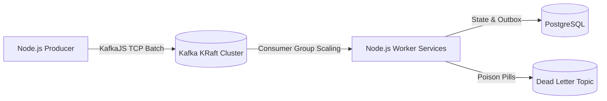

# 🚀 Apache Kafka + Node.js Complete Hands-On Learning Repository

> A comprehensive, interactive, production-grade learning course and repository for mastering Apache Kafka with Node.js.

[-black.svg?logo=apachekafka)](https://kafka.apache.org/)
[](https://nodejs.org/)
[](https://kafka.js.org/)
[](https://docker.com)

---

## 📚 Table of Contents
- [1. Course Architecture & Philosophy](#1-course-architecture--philosophy)
- [2. Quick Start (Get Running in 2 Minutes)](#2-quick-start-get-running-in-2-minutes)
- [3. Curriculum & Progress Checklist](#3-curriculum--progress-checklist)
- [4. Hands-On Labs (01 – 12)](#4-hands-on-labs-01--12)
- [5. Failure & Edge-Case Experiments (01 – 08)](#5-failure--edge-case-experiments-01--08)
- [6. End-to-End Projects (01 – 04)](#6-end-to-end-projects-01--04)
- [7. Capstone Project](#7-capstone-project)
- [8. Reference Manuals & Cheatsheets](#8-reference-manuals--cheatsheets)

---

## 1. Course Architecture & Philosophy

Every concept in this course follows the **Interactive Discovery Cycle**:
```text
CONCEPT → WHY DOES IT EXIST? → ARCHITECTURE DIAGRAM → RUN CODE → OBSERVE BEHAVIOR → BREAK IT (EXPERIMENT) → PRODUCTION CONSIDERATIONS
```



---

## 2. Quick Start (Get Running in 2 Minutes)

### Step 1: Start Docker Infrastructure
```bash
npm run docker:up
```
This spins up:
- **Apache Kafka 3.7 (KRaft mode)** on port `9092`
- **Kafka UI** on port `8080` (Open [http://localhost:8080](http://localhost:8080))
- **PostgreSQL 16** on port `5432`
- **Redis 7** on port `6379`

### Step 2: Verify Kafka Health
```bash
npm run wait:kafka
```

### Step 3: Run your first Producer & Consumer
```bash
# Terminal 1: Run consumer
npm run lab:02:consumer

# Terminal 2: Run producer
npm run lab:02:producer
```

---

## 3. Curriculum & Progress Checklist

Track your progress through the 24 modules:

- [ ] [00 — Course Overview & Roadmap](file:///docs/00-course-overview.md)
- [ ] [01 — Kafka Fundamentals](file:///docs/01-kafka-fundamentals.md)
- [ ] [02 — Kafka Architecture & Storage Internals](file:///docs/02-kafka-architecture.md)
- [ ] [03 — Topics & Naming Best Practices](file:///docs/03-topics.md)
- [ ] [04 — Partitions & Partitioning Strategies](file:///docs/04-partitions.md)
- [ ] [05 — Producers & Publishing Patterns](file:///docs/05-producers.md)
- [ ] [06 — Consumers & Polling Loop](file:///docs/06-consumers.md)
- [ ] [07 — Consumer Groups & Load Balancing](file:///docs/07-consumer-groups.md)
- [ ] [08 — Offsets & Commit Management](file:///docs/08-offsets.md)
- [ ] [09 — Message Keys & Ordering Guarantees](file:///docs/09-message-keys.md)
- [ ] [10 — Replication, Leaders & In-Sync Replicas (ISR)](file:///docs/10-replication.md)
- [ ] [11 — Delivery Semantics (At-Most, At-Least, Exactly-Once)](file:///docs/11-delivery-semantics.md)
- [ ] [12 — Retry Architecture & Exponential Backoff](file:///docs/12-retries.md)
- [ ] [13 — Dead Letter Topics (DLT / DLQ)](file:///docs/13-dead-letter-topics.md)
- [ ] [14 — Idempotency & Deduplication](file:///docs/14-idempotency.md)
- [ ] [15 — Schema Management & Evolution](file:///docs/15-schema-management.md)
- [ ] [16 — Kafka Connect & Change Data Capture (CDC)](file:///docs/16-kafka-connect.md)
- [ ] [17 — Kafka Streams & Real-Time Processing Concepts](file:///docs/17-kafka-streams-concepts.md)
- [ ] [18 — Transactions & Exactly-Once Semantics (EOS)](file:///docs/18-transactions.md)
- [ ] [19 — Performance Tuning, Batching & Compression](file:///docs/19-performance.md)
- [ ] [20 — Monitoring & Consumer Lag](file:///docs/20-monitoring.md)
- [ ] [21 — Kafka Security: TLS, SASL & ACLs](file:///docs/21-security.md)
- [ ] [22 — Production Architecture & Operational Best Practices](file:///docs/22-production-architecture.md)
- [ ] [23 — Kafka vs. Other Messaging Systems](file:///docs/23-kafka-vs-other-messaging.md)

---

## 4. Hands-On Labs (01 – 12)

Each lab contains dedicated `README.md`, `src/` (working code), `exercise/` (scaffolded challenge), and `solution/` (reference code):

| Lab | Topic | Run Command |
| :--- | :--- | :--- |
| **Lab 01** | First Producer & Record Metadata | `npm run lab:01:producer` |
| **Lab 02** | First Consumer & Polling Loop | `npm run lab:02:consumer` |
| **Lab 03** | Topics & Admin Client Management | `npm run lab:03:admin` |
| **Lab 04** | Partitions & Load Distribution | `npm run lab:04:producer` |
| **Lab 05** | Consumer Groups & Scaling | `npm run lab:05:producer` |
| **Lab 06** | Message Keys & Ordering Affinity | `npm run lab:06:producer` |
| **Lab 07** | Offsets & Manual Commit Strategies | `npm run lab:07:consumer` |
| **Lab 08** | Non-Blocking Topic Retries | `npm run lab:08:consumer` |
| **Lab 09** | Dead Letter Topics & Poison Pills | `npm run lab:09:consumer` |
| **Lab 10** | Idempotency & Deduplication Table | `npm run lab:10:consumer` |
| **Lab 11** | Atomic Multi-Topic Transactions | `npm run lab:11:service` |
| **Lab 12** | Batching & Compression Benchmark | `npm run lab:12:benchmark` |

---

## 5. Failure & Edge-Case Experiments (01 – 08)

Interactive experiments where we intentionally cause and observe distributed system anomalies:

- **Experiment 01 — Partition Ordering Skew**: `npm run exp:01:ordering`
- **Experiment 02 — Consumer Crash & Resume**: `npm run exp:02:failure`
- **Experiment 03 — Consumer Rebalance Timeline**: `npm run exp:03:rebalance`
- **Experiment 04 — Duplicate Processing on Crash**: `npm run exp:04:duplicates`
- **Experiment 05 — Transient Error Retry Pipeline**: `npm run exp:05:retries`
- **Experiment 06 — Slow Consumer Lag Explosion**: `npm run exp:06:lag`
- **Experiment 07 — Low-Cardinality Key Skew**: `npm run exp:07:hot-partition`
- **Experiment 08 — Uncommitted Offset Replay**: `npm run exp:08:uncommitted`

---

## 6. End-to-End Projects (01 – 04)

- **Project 01 — Event Logger & Metric Tracker**: `npm run project:01:start`
- **Project 02 — Notification Fan-Out System**: `npm run project:02:workers` & `npm run project:02:api`
- **Project 03 — Event-Driven E-Commerce**: `npm run project:03:start`
- **Project 04 — Production-Grade Event Platform**: `npm run project:04:start` (Includes Transactional Outbox + PostgreSQL + Dead Letter Queues)

---

## 7. Capstone Project

**Fintech Real-Time Fraud & Payment Streaming Engine**
- Specification: [capstone/README.md](file:///capstone/README.md)
- Run Reference Solution: `npm run capstone:start`

---

## 8. Reference Manuals & Cheatsheets

- 📖 [Kafka CLI Manual](file:///reference/kafka-cli.md)
- 📖 [KafkaJS Configuration Encyclopedia](file:///reference/kafkajs.md)
- 📖 [Troubleshooting & Error Triage Guide](file:///reference/troubleshooting.md)
- 📖 [Kafka & Event Streaming Glossary](file:///reference/glossary.md)
- 📖 [Quick Reference Cheat Sheet](file:///reference/cheat-sheet.md)
