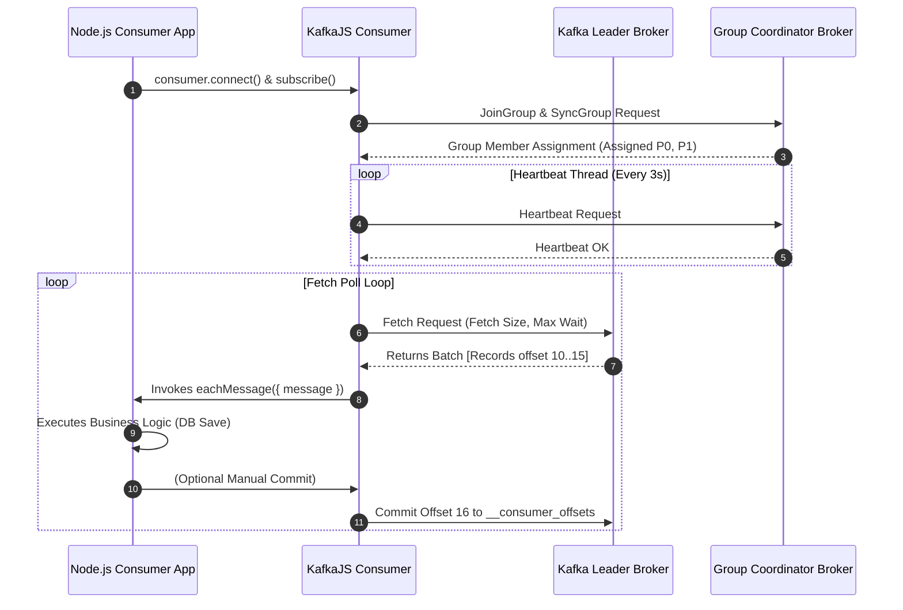

# Consumer Polling & Processing Flow

```mermaid
sequenceDiagram
    autonumber
    participant App as Node.js Consumer App
    participant Consumer as KafkaJS Consumer
    participant Broker as Kafka Leader Broker
    participant Coord as Group Coordinator Broker

    App->>Consumer: consumer.connect() & subscribe()
    Consumer->>Coord: JoinGroup & SyncGroup Request
    Coord-->>Consumer: Group Member Assignment (Assigned P0, P1)
    
    loop Heartbeat Thread (Every 3s)
        Consumer->>Coord: Heartbeat Request
        Coord-->>Consumer: Heartbeat OK
    end

    loop Fetch Poll Loop
        Consumer->>Broker: Fetch Request (Fetch Size, Max Wait)
        Broker-->>Consumer: Returns Batch [Records offset 10..15]
        Consumer->>App: Invokes eachMessage({ message })
        App->>App: Executes Business Logic (DB Save)
        App->>Consumer: (Optional Manual Commit)
        Consumer->>Broker: Commit Offset 16 to __consumer_offsets
    end
```
