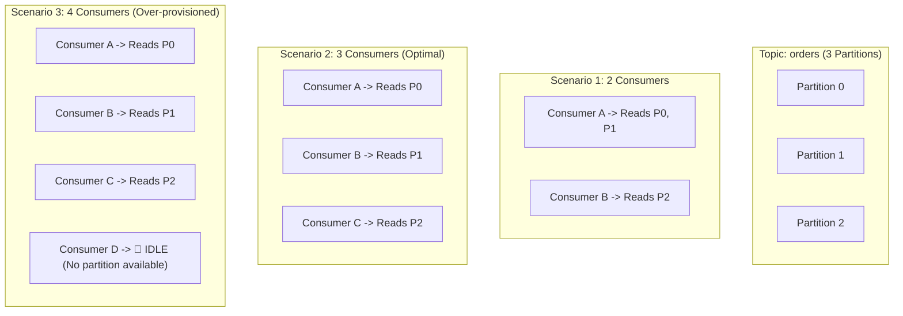

# Consumer Group Scaling & Rebalancing

```mermaid
flowchart TB
    subgraph Topic ["Topic: orders (3 Partitions)"]
        P0[Partition 0]
        P1[Partition 1]
        P2[Partition 2]
    end

    subgraph State1 ["Scenario 1: 2 Consumers"]
        C1A["Consumer A -> Reads P0, P1"]
        C1B["Consumer B -> Reads P2"]
    end

    subgraph State2 ["Scenario 2: 3 Consumers (Optimal)"]
        C2A["Consumer A -> Reads P0"]
        C2B["Consumer B -> Reads P1"]
        C2C["Consumer C -> Reads P2"]
    end

    subgraph State3 ["Scenario 3: 4 Consumers (Over-provisioned)"]
        C3A["Consumer A -> Reads P0"]
        C3B["Consumer B -> Reads P1"]
        C3C["Consumer C -> Reads P2"]
        C3D["Consumer D -> 🛑 IDLE (No partition available)"]
    end
```
