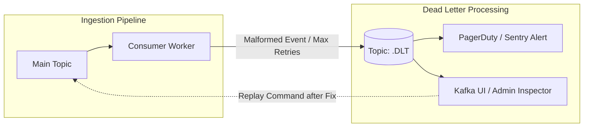

# Dead Letter Topic (DLT / DLQ) Architecture

```mermaid
flowchart LR
    subgraph Ingestion ["Ingestion Pipeline"]
        Source[Main Topic] --> Worker[Consumer Worker]
    end

    subgraph ErrorHandling ["Dead Letter Processing"]
        Worker -->|Malformed Event / Max Retries| DLT[(Topic: <name>.DLT)]
        DLT --> Alerting[PagerDuty / Sentry Alert]
        DLT --> InspectUI[Kafka UI / Admin Inspector]
        InspectUI -.->|Replay Command after Fix| Source
    end
```
