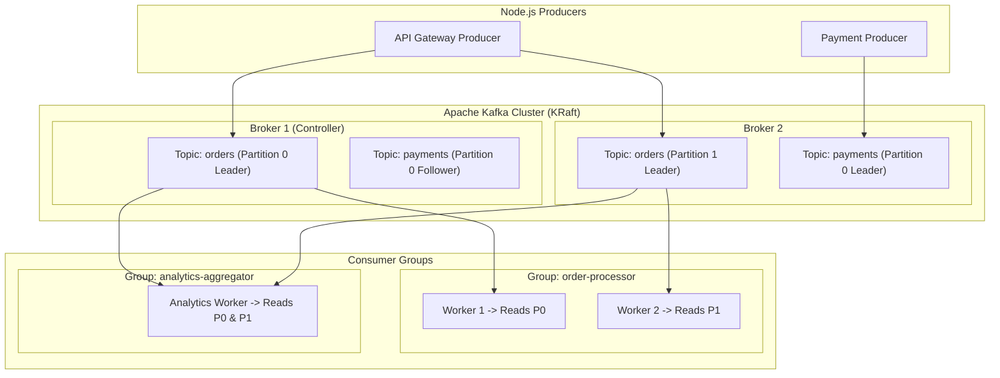

# Kafka End-to-End Architecture Overview

```mermaid
flowchart TB
    subgraph Producers ["Node.js Producers"]
        P1["API Gateway Producer"]
        P2["Payment Producer"]
    end

    subgraph KafkaCluster ["Apache Kafka Cluster (KRaft)"]
        subgraph Broker1 ["Broker 1 (Controller)"]
            T1P0["Topic: orders (Partition 0 Leader)"]
            T2P0["Topic: payments (Partition 0 Follower)"]
        end
        subgraph Broker2 ["Broker 2"]
            T1P1["Topic: orders (Partition 1 Leader)"]
            T2P1["Topic: payments (Partition 0 Leader)"]
        end
    end

    subgraph ConsumerGroups ["Consumer Groups"]
        subgraph OrderWorkers ["Group: order-processor"]
            C1["Worker 1 -> Reads P0"]
            C2["Worker 2 -> Reads P1"]
        end
        subgraph AnalyticsWorkers ["Group: analytics-aggregator"]
            C3["Analytics Worker -> Reads P0 & P1"]
        end
    end

    P1 --> T1P0
    P1 --> T1P1
    P2 --> T2P1

    T1P0 --> C1
    T1P1 --> C2

    T1P0 --> C3
    T1P1 --> C3
```
