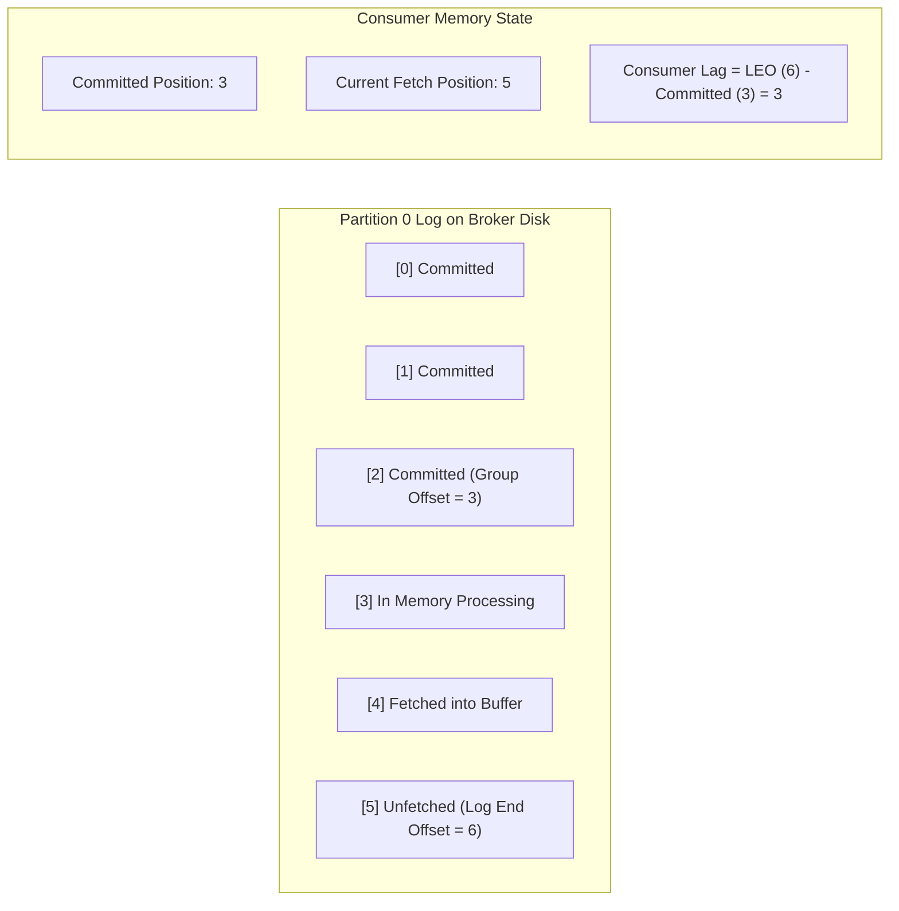

# Offsets, Fetch Position & Commit Lifecycle

```mermaid
flowchart LR
    subgraph Log ["Partition 0 Log on Broker Disk"]
        direction LR
        O0["[0] Committed"]
        O1["[1] Committed"]
        O2["[2] Committed (Group Offset = 3)"]
        O3["[3] In Memory Processing"]
        O4["[4] Fetched into Buffer"]
        O5["[5] Unfetched (Log End Offset = 6)"]
    end

    subgraph ConsumerState ["Consumer Memory State"]
        CP["Committed Position: 3"]
        FP["Current Fetch Position: 5"]
        Lag["Consumer Lag = LEO (6) - Committed (3) = 3"]
    end
```
