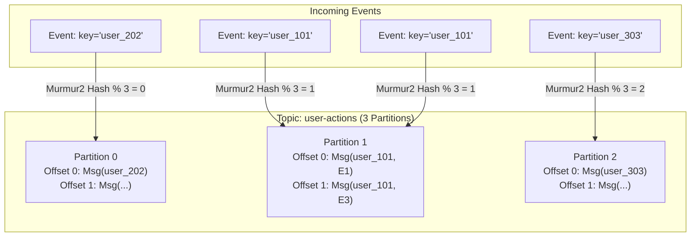

# Partitioning Architecture

```mermaid
flowchart TD
    subgraph InputEvents ["Incoming Events"]
        E1["Event: key='user_101'"]
        E2["Event: key='user_202'"]
        E3["Event: key='user_101'"]
        E4["Event: key='user_303'"]
    end

    subgraph TopicPartitions ["Topic: user-actions (3 Partitions)"]
        P0["Partition 0<br/>Offset 0: Msg(user_202)<br/>Offset 1: Msg(...)"]
        P1["Partition 1<br/>Offset 0: Msg(user_101, E1)<br/>Offset 1: Msg(user_101, E3)"]
        P2["Partition 2<br/>Offset 0: Msg(user_303)<br/>Offset 1: Msg(...)"]
    end

    E1 -->|Murmur2 Hash % 3 = 1| P1
    E2 -->|Murmur2 Hash % 3 = 0| P0
    E3 -->|Murmur2 Hash % 3 = 1| P1
    E4 -->|Murmur2 Hash % 3 = 2| P2
```
