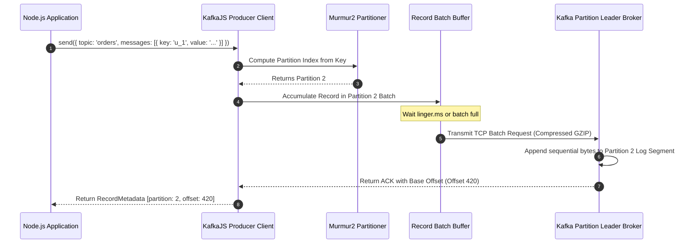

# Producer Internal Flow

```mermaid
sequenceDiagram
    autonumber
    participant App as Node.js Application
    participant Producer as KafkaJS Producer Client
    participant Partitioner as Murmur2 Partitioner
    participant Buffer as Record Batch Buffer
    participant Broker as Kafka Partition Leader Broker

    App->>Producer: send({ topic: 'orders', messages: [{ key: 'u_1', value: '...' }] })
    Producer->>Partitioner: Compute Partition Index from Key
    Partitioner-->>Producer: Returns Partition 2
    Producer->>Buffer: Accumulate Record in Partition 2 Batch
    Note over Buffer: Wait linger.ms or batch full
    Buffer->>Broker: Transmit TCP Batch Request (Compressed GZIP)
    Broker->>Broker: Append sequential bytes to Partition 2 Log Segment
    Broker-->>Producer: Return ACK with Base Offset (Offset 420)
    Producer-->>App: Return RecordMetadata [partition: 2, offset: 420]
```
