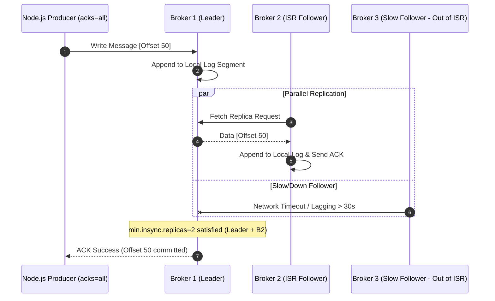

# Broker Replication & ISR Consensus

```mermaid
sequenceDiagram
    autonumber
    participant P as Node.js Producer (acks=all)
    participant B1 as Broker 1 (Leader)
    participant B2 as Broker 2 (ISR Follower)
    participant B3 as Broker 3 (Slow Follower - Out of ISR)

    P->>B1: Write Message [Offset 50]
    B1->>B1: Append to Local Log Segment
    par Parallel Replication
        B2->>B1: Fetch Replica Request
        B1-->>B2: Data [Offset 50]
        B2->>B2: Append to Local Log & Send ACK
    and Slow/Down Follower
        B3-xB1: Network Timeout / Lagging > 30s
    end
    Note over B1: min.insync.replicas=2 satisfied (Leader + B2)
    B1-->>P: ACK Success (Offset 50 committed)
```
