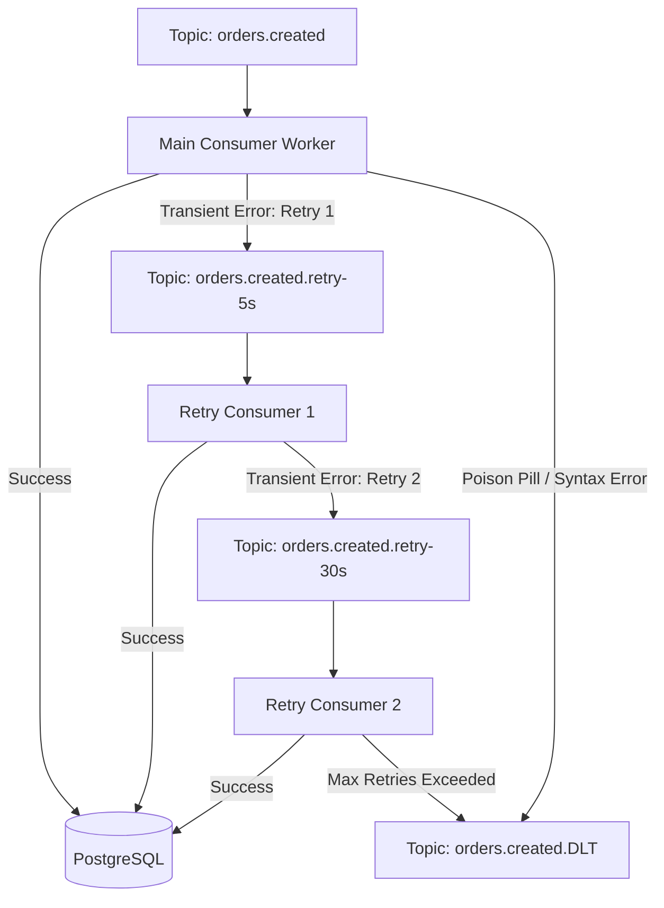

# Non-Blocking Topic-Based Retry Flow

```mermaid
flowchart TD
    Main[Topic: orders.created] --> CMain[Main Consumer Worker]
    
    CMain -->|Success| DB[(PostgreSQL)]
    CMain -->|Transient Error: Retry 1| R1[Topic: orders.created.retry-5s]
    
    R1 --> CR1[Retry Consumer 1]
    CR1 -->|Success| DB
    CR1 -->|Transient Error: Retry 2| R2[Topic: orders.created.retry-30s]

    R2 --> CR2[Retry Consumer 2]
    CR2 -->|Success| DB
    CR2 -->|Max Retries Exceeded| DLT[Topic: orders.created.DLT]

    CMain -->|Poison Pill / Syntax Error| DLT
```
