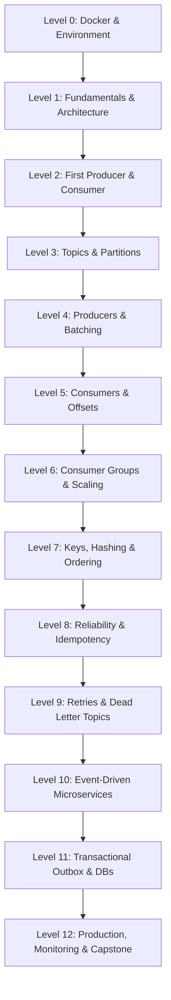

# 00 — Course Overview & Learning Roadmap

Welcome to the **Complete Apache Kafka + Node.js Hands-On Course**!

This course is designed for backend engineers, system architects, and Node.js developers who want to master Apache Kafka through hands-on practice, architecture diagrams, live code, intentional failure experiments, and production-grade project builds.

---

## 🎯 Course Goals

By the end of this course, you will:
1. **Understand Kafka Internals**: Brokers, Topics, Partitions, Segments, In-Sync Replicas (ISR), and KRaft metadata quorums.
2. **Master KafkaJS**: Build resilient producers and consumers with fine-tuned batching, compression, manual commit strategies, and rebalance listeners.
3. **Guarantee Message Reliability**: Implement Idempotent Producers, Idempotent Consumers (Deduplication tables), Dead Letter Topics (DLT), and Exponential Backoff Retries.
4. **Architect Event-Driven Microservices**: Build scalable distributed systems using the Transactional Outbox pattern, fan-out topologies, and PostgreSQL/Redis integration.
5. **Debug Distributed Failures**: Understand what happens during network partitions, broker crashes, slow consumer lag, and rebalance storms.

---

## 🗺️ Progressive Curriculum



---

## 🧭 Repository Structure

- **`docs/`** (00 to 23): Concise, deeply technical modules covering every core concept.
- **`diagrams/`**: Dedicated Mermaid architecture blueprints.
- **`labs/`** (01 to 12): Hands-on exercises with step-by-step instructions and separate exercise/solution code.
- **`experiments/`** (01 to 08): Intentional failure scripts demonstrating edge-case Kafka behaviors.
- **`projects/`** (01 to 04): Progressive multi-service applications from simple loggers to enterprise platforms.
- **`exercises/`**: Quizzes, debugging puzzles, and architecture design challenges.
- **`reference/`**: Kafka CLI commands, KafkaJS configuration cheat-sheets, and troubleshooting guides.
- **`capstone/`**: Real-world fintech fraud & transaction streaming platform.

---

## 🏁 How to Start

1. Start your Kafka cluster:
   ```bash
   npm run docker:up
   npm run wait:kafka
   ```
2. Open Kafka UI in your browser: **http://localhost:8080**
3. Proceed to `docs/01-kafka-fundamentals.md` and start with **Lab 01** (`labs/01-first-producer/`).
