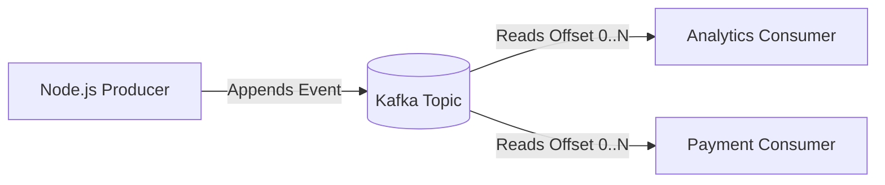
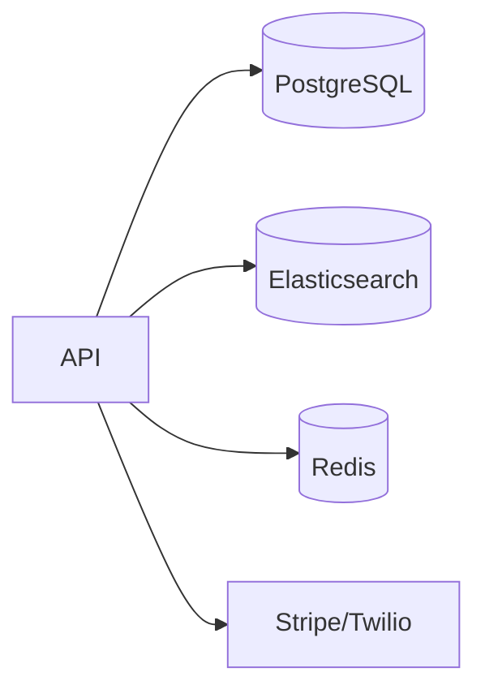
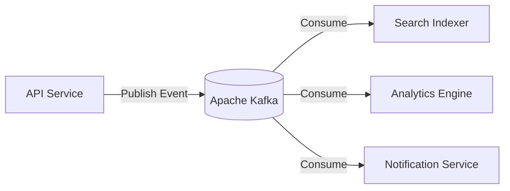

# 01 — Kafka Fundamentals

## 1. What is Apache Kafka?
Apache Kafka is an **immutable, distributed, append-only commit log** optimized for high-throughput, fault-tolerant event streaming.

Unlike traditional message queues (like RabbitMQ or SQS) where messages are deleted as soon as they are consumed, Kafka **retains messages on disk** regardless of whether they have been read. Multiple independent consumers can read the same stream at their own pace, and re-read historical data whenever needed.

---

## 2. Core Concepts at a Glance

| Concept | What It Is | Real-World Analogy |
| :--- | :--- | :--- |
| **Event / Message** | A record consisting of a key, value, timestamp, and headers | A transaction receipt |
| **Topic** | A categorized stream of events | A database table or folder |
| **Partition** | An ordered, immutable commit log chunk inside a topic | A single ledger book in an accounting department |
| **Offset** | A sequential integer assigned to each message in a partition | Page number in the ledger book |
| **Broker** | A single Kafka server node storing and serving partition logs | An individual server machine |
| **Cluster** | A collection of brokers working together | A server fleet |
| **Producer** | A client application that publishes events to topics | A point-of-sale terminal generating orders |
| **Consumer** | A client application that subscribes to and reads topics | A fulfillment warehouse tracking new orders |
| **Consumer Group** | A coordinated pool of consumers dividing partitions among themselves | A team of workers splitting incoming shipments |

---

## 3. What Beginners Think vs. What Kafka Actually Does

| What Beginners Think 💭 | What Kafka Actually Does ⚙️ |
| :--- | :--- |
| "Kafka pushes messages to consumers." | **Kafka is pull-based (poll-based).** Consumers pull batches of messages at their own processing rate. |
| "Kafka deletes messages once read." | **Kafka stores messages until retention expires** (e.g., 7 days, or size limit), regardless of consumer reads. |
| "Kafka guarantees global message order." | **Kafka ONLY guarantees order within a single partition.** Messages across different partitions arrive independently. |
| "A topic is just a single queue." | **A topic is sharded into one or more parallel partitions.** |

---

## 4. Why Does Kafka Exist?

Before Kafka, systems were wired together with point-to-point connections:

As systems grow, $N$ services need $N^2$ connections, causing tight coupling, cascading failures, and zero replayability.

With Kafka:

The producer only cares about publishing an event once. Any current or future service can consume that stream asynchronously without impacting the producer.

---

## 5. Next Steps
Move to [02-kafka-architecture.md](file:///c:/Users/Sulaiman/Desktop/pratice-dev/docs/02-kafka-architecture.md) to understand how the storage engine, KRaft, and brokers function under the hood.
