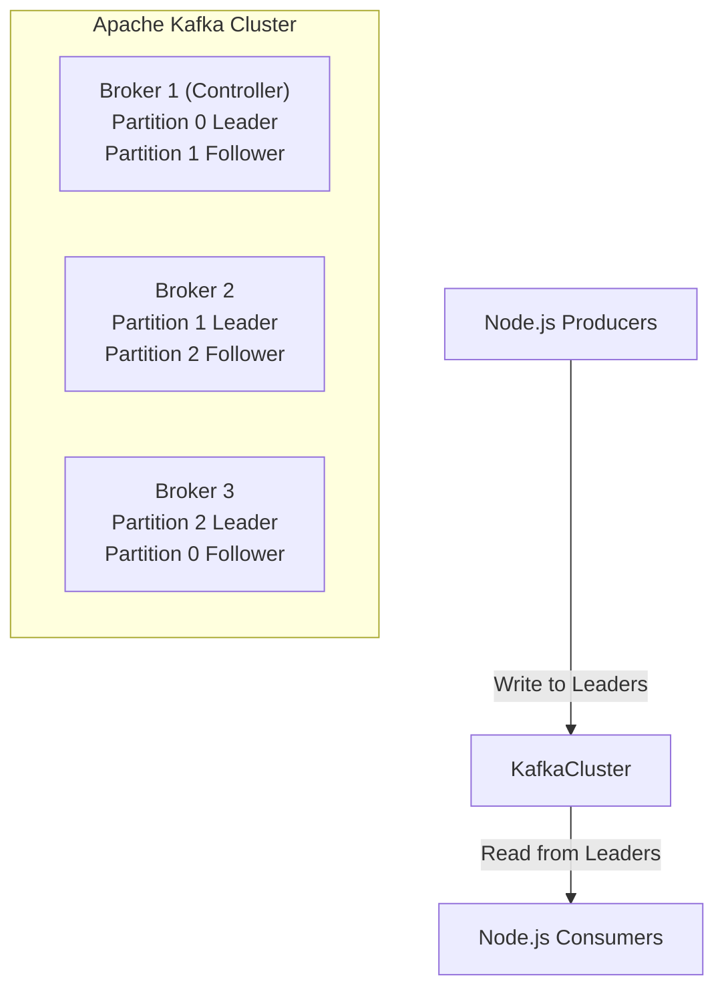
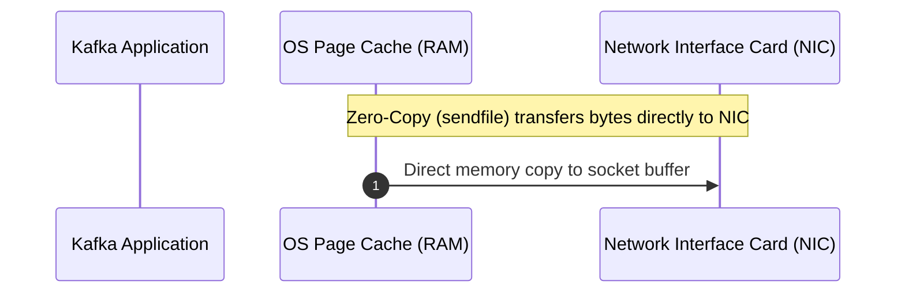

# 02 — Kafka Architecture & Storage Internals

## 1. High-Level Architecture

Kafka operates as a distributed cluster of broker instances coordinated by the **KRaft (Kafka Raft)** metadata consensus protocol (or previously Apache ZooKeeper).



---

## 2. The Log Storage Engine: Why Kafka is Incredibly Fast

Many engineers assume disk I/O is slow. Kafka proves sequential disk I/O is nearly as fast as memory access due to:

1. **Sequential Disk Appends**: Kafka only writes to the end of a log file (`O(1)` append), avoiding slow random disk seeks.
2. **Page Cache Architecture**: Kafka writes directly to the OS Page Cache (RAM), leaving memory management to the OS kernel.
3. **Zero-Copy Network Transfer (`sendfile`)**: Data is moved directly from OS Page Cache to the network socket without copying data into Kafka's JVM application memory space.



---

## 3. Physical Disk Structure: Segments & Indexes

Each partition is stored on disk as a folder named `<topic>-<partition_id>`. Inside this folder are **Segment Files**:

```text
/var/lib/kafka/data/orders-0/
├── 00000000000000000000.log       <- Actual serialized message payloads
├── 00000000000000000000.index     <- Maps logical offset to physical byte position
├── 00000000000000000000.timeindex <- Maps timestamp to offset
├── leader-epoch-checkpoint
```

- When a segment reaches `segment.bytes` (default 1GB) or `segment.ms` (default 7 days), it is closed and a new active segment is rolled.
- Retention cleanup (delete or compact) operates on entire closed segments, making log cleanup lightning-fast without rewriting the whole file.

---

## 4. KRaft (Kafka Raft Metadata Mode)

In modern Kafka (3.0+), ZooKeeper is deprecated in favor of **KRaft**:
- Metadata is stored in an internal Kafka topic `@metadata`.
- A small quorum of brokers act as **Active Controller** and **Followers**.
- Failover takes milliseconds instead of seconds, and clusters scale to millions of partitions.

---

## 5. Next Steps
Go to [03-topics.md](file:///c:/Users/Sulaiman/Desktop/pratice-dev/docs/03-topics.md) to learn how to design, create, and manage Kafka topics.
