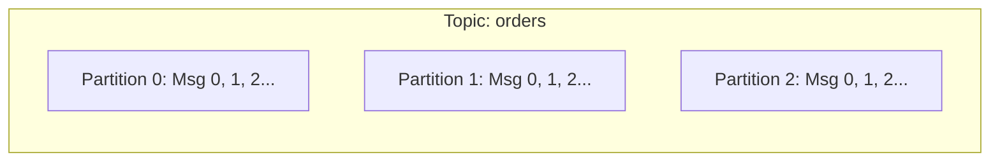

# 03 — Topics

## 1. What is a Topic?
A **Topic** is a named, logical stream of events in Kafka. Think of it as a table in a relational database or a directory of append-only log files.



---

## 2. Topic Naming Conventions (Industry Best Practices)

A good topic naming convention avoids chaos across engineering teams:

$$\text{<domain>.<entity>.<event-type>.<version>}$$

Examples:
- `commerce.orders.created.v1`
- `commerce.orders.cancelled.v1`
- `payments.transactions.settled.v1`
- `identity.users.registered.v1`

**Rules:**
1. Use lowercase letters, dots, and hyphens (avoid underscores to prevent metric collision).
2. Never reuse a topic name with incompatible schema changes; increment the version suffix (e.g., `v2`).

---

## 3. Key Topic Configuration Parameters

| Parameter | Default | Production Recommendation | Description |
| :--- | :--- | :--- | :--- |
| `partitions` | 1 | 3–12 (based on throughput) | Number of parallel log streams |
| `replication.factor` | 1 (dev) | 3 | Number of broker copies for fault tolerance |
| `retention.ms` | 604800000 (7 days) | Project-specific (e.g. 7 days or 30 days) | Duration to keep log data before pruning |
| `cleanup.policy` | `delete` | `delete` or `compact` | `delete` prunes old records; `compact` keeps latest record per key |
| `min.insync.replicas`| 1 | 2 (with RF=3) | Minimum replicas that must acknowledge a write |

---

## 4. Managing Topics with KafkaJS Admin Client

```javascript
import { Kafka } from 'kafkajs';

const kafka = new Kafka({ clientId: 'admin-app', brokers: ['localhost:9092'] });
const admin = kafka.admin();

await admin.connect();

// Create topic
await admin.createTopics({
  waitForLeaders: true,
  topics: [
    {
      topic: 'commerce.orders.created.v1',
      numPartitions: 3,
      replicationFactor: 1,
      configEntries: [
        { name: 'retention.ms', value: '86400000' } // 24 hours
      ]
    }
  ]
});

// List all topics
const topics = await admin.listTopics();
console.log('Available topics:', topics);

await admin.disconnect();
```

---

## 5. Next Steps
Explore [04-partitions.md](file:///c:/Users/Sulaiman/Desktop/pratice-dev/docs/04-partitions.md) to understand how partitions enable Kafka's horizontal scalability.
