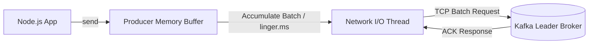

# 05 — Producers & Publishing Patterns

## 1. Producer Lifecycle & Internal Buffering

A Kafka producer does not immediately send each message to the broker over the network one by one. Instead, it accumulates messages into an internal memory buffer organized by target partition, and flushes batches over TCP connections.



---

## 2. KafkaJS Producer Configuration & Options

```javascript
import { Kafka, CompressionTypes } from 'kafkajs';

const kafka = new Kafka({
  clientId: 'order-api-producer',
  brokers: ['localhost:9092'],
  retry: {
    initialRetryTime: 300,
    retries: 8
  }
});

// Idempotent producer prevents duplicate messages and out-of-order retries
const producer = kafka.producer({
  idempotent: true,
  maxInFlightRequests: 1
});

await producer.connect();

const result = await producer.send({
  topic: 'commerce.orders.created.v1',
  compression: CompressionTypes.GZIP,
  acks: -1, // Wait for all In-Sync Replicas (all ISR)
  messages: [
    {
      key: 'order_9901',
      value: JSON.stringify({
        orderId: 'order_9901',
        userId: 'user_44',
        amount: 250.00,
        createdAt: new Date().toISOString()
      }),
      headers: {
        'correlation-id': 'corr-abc-123',
        'source-service': 'order-api'
      }
    }
  ]
});

console.log('Message delivered to partition:', result[0].partition, 'offset:', result[0].baseOffset);
await producer.disconnect();
```

---

## 3. Acknowledgements (`acks`) Explained

| `acks` Setting | Description | Data Safety | Latency |
| :--- | :--- | :--- | :--- |
| `acks = 0` | Producer sends and does NOT wait for any reply. | ❌ High risk of data loss if broker crashes | Fastest |
| `acks = 1` | Waits for the **Partition Leader** broker to write to its local disk. | ⚠️ Low risk; lost if leader dies before replicating to follower | Medium |
| `acks = -1` (`acks = all`) | Waits for the Leader AND all In-Sync Replicas (`min.insync.replicas`). | ✅ Zero data loss guarantee | High safety |

---

## 4. Batching and Throughput Tuning

- **`compression`**: Use `CompressionTypes.GZIP` or `CompressionTypes.Snappy` to reduce network payload sizes by 50–80%.
- **`maxInFlightRequests`**: Number of unacknowledged requests allowed concurrently. Set to `1` when ordering across retries is critical without idempotency, or leave default with `idempotent: true`.

---

## 5. Next Steps
Go to [06-consumers.md](file:///c:/Users/Sulaiman/Desktop/pratice-dev/docs/06-consumers.md) to build resilient event consumers.
