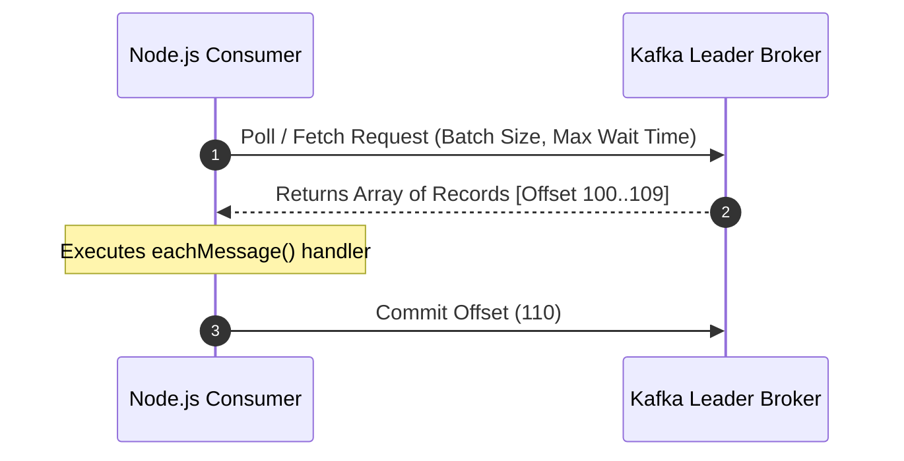

# 06 — Consumers & Polling Loop

## 1. How Consumers Work: The Poll Loop

Kafka consumers are **pull-based**. The consumer establishes long-polling TCP connections to the partition leader brokers, fetching batches of messages into memory and executing your business logic.



---

## 2. KafkaJS Consumer Implementation

```javascript
import { Kafka } from 'kafkajs';

const kafka = new Kafka({
  clientId: 'notification-worker',
  brokers: ['localhost:9092']
});

const consumer = kafka.consumer({
  groupId: 'notification-service-group',
  sessionTimeout: 30000,
  heartbeatInterval: 3000
});

await consumer.connect();

// Subscribe to one or multiple topics
await consumer.subscribe({
  topic: 'commerce.orders.created.v1',
  fromBeginning: false // false = only new messages; true = replay from earliest offset if no committed offset exists
});

await consumer.run({
  autoCommit: true,
  autoCommitInterval: 5000,
  eachMessage: async ({ topic, partition, message, heartbeat }) => {
    const key = message.key?.toString();
    const payload = JSON.parse(message.value.toString());
    const offset = message.offset;

    console.log(`[P${partition}@${offset}] Received event:`, payload);

    // If processing takes long, send heartbeat to prevent rebalance
    await heartbeat();
  }
});
```

---

## 3. `eachMessage` vs. `eachBatch`

| Feature | `eachMessage` | `eachBatch` |
| :--- | :--- | :--- |
| **Granularity** | Invokes callback for one record at a time | Passes entire fetched batch of records |
| **Commit Control** | Automatically handled or manual per record | Fine-grained manual control (e.g. bulk database insert then commit) |
| **Heartbeat** | `heartbeat()` callback provided | `heartbeat()` + batch progress markers provided |
| **Best For** | Standard event processing, clean logic | High-throughput batch inserts (PostgreSQL `COPY`, Elasticsearch bulk) |

---

## 4. Heartbeats & Rebalance Avoidance

Consumers send background heartbeats to the **Group Coordinator** broker. If a consumer's event loop blocks longer than `sessionTimeout` (default 30s) or `maxPollInterval` (KafkaJS `maxWaitTimeInMs`), the coordinator assumes the consumer is dead and triggers a **Rebalance**, kicking the consumer out.

---

## 5. Next Steps
Go to [07-consumer-groups.md](file:///c:/Users/Sulaiman/Desktop/pratice-dev/docs/07-consumer-groups.md) to understand consumer scaling and rebalance protocols.
