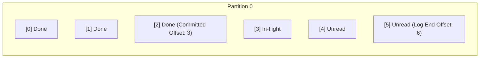

# 08 — Offsets & Commit Management

## 1. What is an Offset?

An **Offset** is a monotonically increasing 64-bit integer assigned to every message arriving at a partition.

- **Current Offset (Fetch Position)**: The next offset the consumer will pull from Kafka.
- **Committed Offset**: The offset stored in Kafka's internal `__consumer_offsets` topic representing the last successfully processed message for a consumer group.



---

## 2. Auto-Commit vs. Manual Commit

### A. Auto-Commit (`autoCommit: true`)
The consumer automatically commits offsets periodically in the background (default every 5000ms).

> [!WARNING]
> **Risk of Data Loss or Duplicates with Auto-Commit:**
> If your application crashes *after* fetching records but *before* finishing database operations, or *after* finishing DB work but *before* auto-commit fires, you will either lose data or process duplicate messages upon restart!

### B. Manual Commit (`autoCommit: false`)
You explicitly commit the offset only after business operations (like database writes) have succeeded:

```javascript
await consumer.run({
  autoCommit: false,
  eachMessage: async ({ topic, partition, message }) => {
    // 1. Process business logic (e.g. database save)
    await saveOrderToDatabase(JSON.parse(message.value.toString()));

    // 2. Explicitly commit the offset + 1 (next unread offset)
    await consumer.commitOffsets([
      {
        topic,
        partition,
        offset: (BigInt(message.offset) + 1n).toString()
      }
    ]);
  }
});
```

---

## 3. Offset Reset Strategies: `earliest` vs. `latest`

When a consumer starts with a new `groupId` (or if its committed offset was expired and pruned by Kafka):
- **`fromBeginning: true` (`earliest`)**: Reads all available messages from the start of the partition (offset 0).
- **`fromBeginning: false` (`latest`)**: Ignores historical messages and only processes messages arriving *after* the consumer starts.

---

## 4. Seeking and Replaying Offsets

With Kafka, you can rewind time and reprocess data:

```javascript
consumer.seek({
  topic: 'commerce.orders.created.v1',
  partition: 0,
  offset: '0' // Rewind to beginning
});
```

---

## 5. Next Steps
Go to [09-message-keys.md](file:///c:/Users/Sulaiman/Desktop/pratice-dev/docs/09-message-keys.md) to learn how message keys preserve ordering across distributed partitions.
