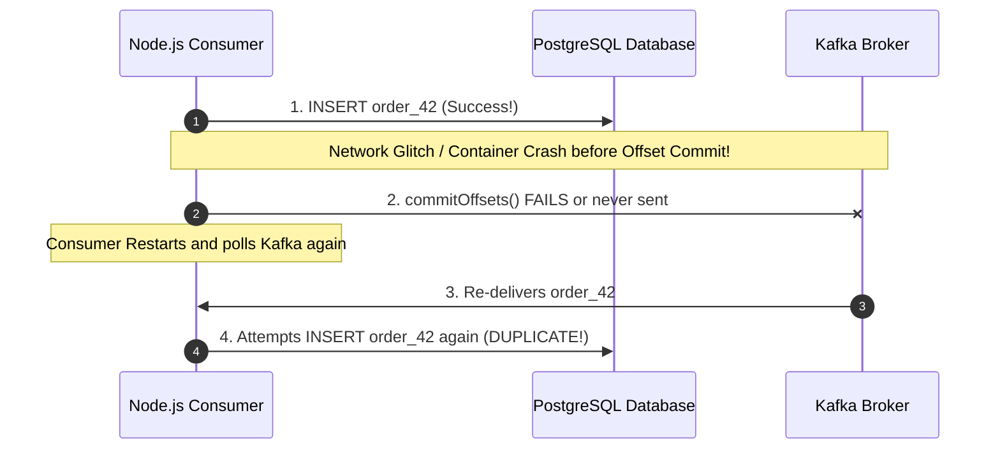

# 11 — Delivery Semantics

## 1. The Three Delivery Guarantees

In distributed messaging, there are three fundamental delivery guarantees:

| Semantic | Message Loss? | Duplicate Processing? | How to Achieve in Node.js |
| :--- | :--- | :--- | :--- |
| **At-Most-Once** | ⚠️ Possible | ❌ Never | `autoCommit: true`, `acks: 0` or commit offset *before* processing work |
| **At-Least-Once** (Default Standard) | ❌ Never | ⚠️ Possible | `acks: all`, `idempotent: true`, commit offset *after* DB transaction succeeds |
| **Exactly-Once (EOS)** | ❌ Never | ❌ Never | Kafka Transactions (`transactional.id`) OR Idempotent Consumer + DB Deduplication Table |

---

## 2. Why Duplicates Occur in Real Networks

Because network acknowledgments can always fail after processing has completed, **At-Least-Once is the default behavior of distributed systems**.

---

## 3. Production Rule: Build for Idempotency

Never assume Kafka will deliver a message exactly once end-to-end to downstream third parties (like Stripe or email APIs). Always combine:
1. **Producer Idempotency** (`idempotent: true`) to prevent broker-level duplicate appends during network retries.
2. **Consumer Idempotency** (Database Unique Key / Deduplication Table) to ensure re-delivered messages do not create duplicate side effects.

---

## 4. Next Steps
Go to [12-retries.md](file:///c:/Users/Sulaiman/Desktop/pratice-dev/docs/12-retries.md) to implement resilient multi-tier retry architectures.
