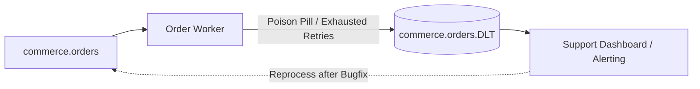

# 13 — Dead Letter Topics (DLT / DLQ)

## 1. What is a Dead Letter Topic?

A **Dead Letter Topic (DLT)** is an isolation topic where unprocessable, corrupt, or permanently failing events are stored for operator inspection, debugging, alerting, and eventual reprocessing.



---

## 2. Essential Metadata Headers for DLT Records

Never dump raw payloads to a DLT without diagnostic context! Always preserve:

```javascript
const dltHeaders = {
  'x-original-topic': topic,
  'x-original-partition': partition.toString(),
  'x-original-offset': message.offset,
  'x-original-timestamp': message.timestamp,
  'x-exception-message': error.message,
  'x-exception-stack': error.stack || '',
  'x-failed-at': new Date().toISOString(),
  'x-retry-attempts': retryCount.toString()
};

await producer.send({
  topic: `${topic}.DLT`,
  messages: [{
    key: message.key,
    value: message.value,
    headers: dltHeaders
  }]
});
```

---

## 3. DLT Recovery Strategies

1. **Dead-Letter Consumer UI**: View and search failing payloads in Kafka UI or a custom web dashboard.
2. **Replay Script**: After fixing the bug in application code, run a CLI utility that reads events from `.DLT` and repushes them to the main topic.

---

## 4. Next Steps
Go to [14-idempotency.md](file:///c:/Users/Sulaiman/Desktop/pratice-dev/docs/14-idempotency.md) to implement bulletproof deduplication tables and idempotent producers.
