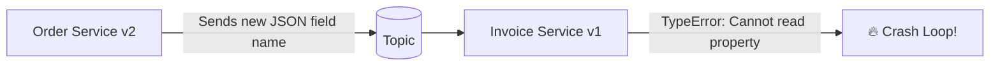

# 15 — Schema Management & Schema Evolution

## 1. The Broken Contract Problem

In loosely-coupled event architectures, producers and consumers deploy independently.
If the producer changes a field from `amount: 100` (number in cents) to `amount: "100.00"` (string formatted in dollars) or deletes `userId`, existing consumer microservices will crash with runtime exceptions!

---

## 2. Schema Evolution Compatibility Modes

| Mode | Meaning | Producer / Consumer Upgrade Order |
| :--- | :--- | :--- |
| **BACKWARD** | New schema can read data written by old schema (delete optional fields, add fields with defaults) | Upgrade **Consumers** first |
| **FORWARD** | Old schema can read data written by new schema (add optional fields, delete fields with defaults) | Upgrade **Producers** first |
| **FULL** | Backward AND Forward compatible (only add/remove fields with default values) | Upgrade in **any order** |

---

## 3. Serialization Formats

1. **Plain JSON**: Easy to debug and inspect, but has no runtime schema enforcement, is verbose, and wastes network bandwidth.
2. **Apache Avro**: Binary compact format with strict schema definitions (`.avsc`) and tight integration with Confluent Schema Registry.
3. **Protocol Buffers (Protobuf)**: Google's cross-platform binary format with language-agnostic `.proto` compilers and strong backward compatibility.

---

## 4. Next Steps
Go to [16-kafka-connect.md](file:///c:/Users/Sulaiman/Desktop/pratice-dev/docs/16-kafka-connect.md) to integrate external databases without writing custom pipeline code.
