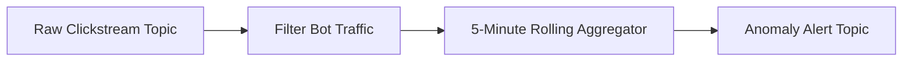

# 17 — Kafka Streams & Real-Time Processing Concepts

## 1. What is Stream Processing?

Traditional batch architectures collect data in a database and run cron queries once an hour or once a day.
**Stream Processing** evaluates events continuously, element-by-element or in tumbling windows, as they occur in real time.

---

## 2. Core Stream Processing Patterns

1. **Stateless Operations**: `filter()`, `map()`, `flatMap()`, `branch()`. Each incoming event is transformed independently without remembering past state.
2. **Stateful Operations**:
   - **Aggregations**: Count of page views per user over the last 10 minutes.
   - **Stream-Stream Joins**: Joining an `order_created` event with an `inventory_reserved` event arriving within 5 seconds of each other.
   - **Stream-Table Joins (Enrichment)**: Joining an `order_created` stream with a cached `user_profiles` table to add user name and email.

---

## 3. Windowing Types

- **Tumbling Window**: Fixed size, non-overlapping (e.g. 00:00–00:05, 00:05–00:10).
- **Hopping (Sliding) Window**: Fixed size, overlapping (e.g. 5-minute window advancing every 1 minute).
- **Session Window**: Dynamic size bounded by periods of inactivity (e.g. user browsing session).

---

## 4. Next Steps
Go to [18-transactions.md](file:///c:/Users/Sulaiman/Desktop/pratice-dev/docs/18-transactions.md) to implement atomic multi-topic transactions.
