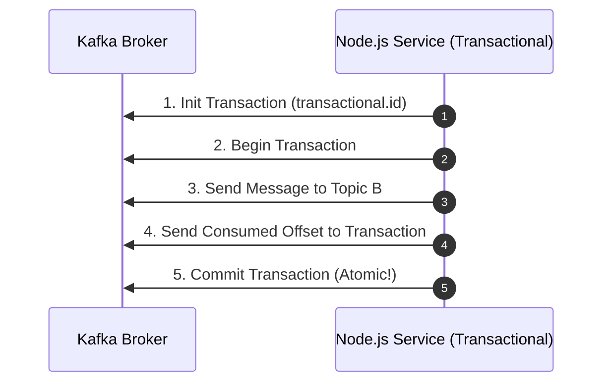

# 18 — Transactions & Exactly-Once Semantics (EOS)

## 1. The Consume-Transform-Produce Problem

In complex pipelines, a service reads an event from Topic A, updates internal state, and produces an event to Topic B.
If the service crashes after publishing to Topic B but before committing offset to Topic A, restarting will cause Topic B to receive a duplicate!



---

## 2. KafkaJS Transactional Producer

```javascript
import { Kafka } from 'kafkajs';

const kafka = new Kafka({ clientId: 'tx-service', brokers: ['localhost:9092'] });
const producer = kafka.producer({
  transactionalId: 'order-settlement-tx-1',
  maxInFlightRequests: 1,
  idempotent: true
});

await producer.connect();
const transaction = await producer.transaction();

try {
  // Send message as part of transaction
  await transaction.send({
    topic: 'finance.settlements.v1',
    messages: [{ key: 'tx_101', value: JSON.stringify({ amount: 500, status: 'PAID' }) }]
  });

  // Atomically commit consumed offsets along with outgoing messages
  await transaction.sendOffsets({
    consumerGroupId: 'payment-processor-group',
    topics: [{ topic: 'orders.pending.v1', partitions: [{ partition: 0, offset: '150' }] }]
  });

  await transaction.commit();
  console.log('✅ Transaction committed atomically!');
} catch (err) {
  console.error('Transaction failed, aborting:', err);
  await transaction.abort();
}
```

---

## 3. Read Committed Isolation Level

Downstream consumers must configure `read_committed` to avoid reading aborted or in-flight transaction records:

```javascript
const consumer = kafka.consumer({
  groupId: 'downstream-audit-group',
  readUncommitted: false // Only read committed transactional messages
});
```

---

## 4. Next Steps
Go to [19-performance.md](file:///c:/Users/Sulaiman/Desktop/pratice-dev/docs/19-performance.md) to maximize throughput and minimize latency.
