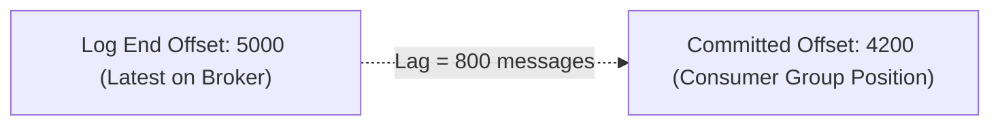

# 20 — Monitoring & Consumer Lag

## 1. What is Consumer Lag?

**Consumer Lag** is the difference between the **Log End Offset (LEO)** (latest message written to the partition) and the **Committed Offset** (last message processed by the consumer group):

$$\text{Consumer Lag} = \text{Log End Offset (LEO)} - \text{Committed Offset}$$



A rising consumer lag means consumers are falling behind the rate of incoming events, leading to delayed notifications, stale caches, or SLA violations.

---

## 2. Diagnosing Consumer Lag

1. **Via Kafka CLI**:
   ```bash
   docker exec -it kafka-node-broker /opt/kafka/bin/kafka-consumer-groups.sh \
     --bootstrap-server localhost:9092 \
     --describe --group notification-service-group
   ```
2. **Via Kafka UI**:
   Navigate to **Consumers** tab in [http://localhost:8080](http://localhost:8080) to visualize per-partition lag graphs in real time.

---

## 3. How to Fix Consumer Lag

1. **Scale Consumers**: If you have 6 partitions and 2 consumers, spin up 4 more consumer instances so every partition has a dedicated worker.
2. **Optimize Processing Logic**: Eliminate slow synchronous HTTP/DB queries inside the `eachMessage` handler. Use connection pools or batch operations with `eachBatch`.
3. **Increase Partitions**: If you already have 1 consumer per partition and CPU is pegged at 100%, increase partition count and deploy additional consumer instances.

---

## 4. Next Steps
Go to [21-security.md](file:///c:/Users/Sulaiman/Desktop/pratice-dev/docs/21-security.md) for SSL/TLS, SASL, and ACL security configurations.
