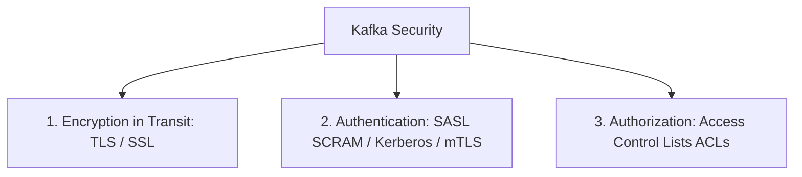

# 21 — Kafka Security: TLS, SASL & ACLs

## 1. The Three Pillars of Kafka Security



---

## 2. Authentication with SASL/SCRAM in KafkaJS

```javascript
import { Kafka } from 'kafkajs';

const kafka = new Kafka({
  clientId: 'secure-client',
  brokers: ['kafka-prod.company.internal:9092'],
  ssl: true, // TLS Encryption
  sasl: {
    mechanism: 'scram-sha-512',
    username: process.env.KAFKA_USERNAME,
    password: process.env.KAFKA_PASSWORD
  }
});
```

---

## 3. Access Control Lists (ACLs)

Kafka ACLs restrict which users or service accounts can perform specific operations (`READ`, `WRITE`, `DESCRIBE`, `CREATE`) on specific resources (`TOPIC`, `GROUP`, `CLUSTER`).

Example CLI rule (Allow user `alice` to produce to `orders` topic):
```bash
kafka-acls.sh --bootstrap-server localhost:9092 \
  --add --allow-principal User:alice \
  --operation Write --topic orders
```

---

## 4. Next Steps
Go to [22-production-architecture.md](file:///c:/Users/Sulaiman/Desktop/pratice-dev/docs/22-production-architecture.md) for production-grade topologies and sizing.
