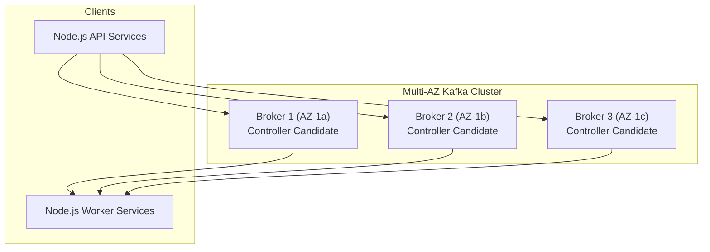

# 22 — Production Architecture & Operational Best Practices

## 1. Multi-Broker Cluster Topology

In enterprise production environments, a Kafka cluster spans a minimum of 3 brokers across multiple Availability Zones (AZs):

---

## 2. Production Checklist

### Infrastructure & Broker Settings
- [ ] $\text{Replication Factor} \ge 3$ for all business-critical topics.
- [ ] $\text{min.insync.replicas} = 2$.
- [ ] `unclean.leader.election.enable = false` (prevents data corruption during broker failure).
- [ ] `auto.create.topics.enable = false` (prevents rogue topics created by typos).

### Node.js Producer Settings
- [ ] `idempotent: true` enabled.
- [ ] `acks: -1` (`acks: all`).
- [ ] Exponential retry configuration with sensible max backoff.
- [ ] `compression: CompressionTypes.GZIP` or `CompressionTypes.Snappy`.

### Node.js Consumer Settings
- [ ] Unique, meaningful `groupId` per microservice.
- [ ] Manual offset commits or idempotent consumer with deduplication table.
- [ ] Graceful shutdown handlers (`SIGTERM`, `SIGINT`) invoking `await consumer.disconnect()`.
- [ ] Dead Letter Topic routing for poison pill exceptions.

---

## 3. Next Steps
Go to [23-kafka-vs-other-messaging.md](file:///c:/Users/Sulaiman/Desktop/pratice-dev/docs/23-kafka-vs-other-messaging.md) to compare Kafka against RabbitMQ, SQS, and Redis Pub/Sub.
