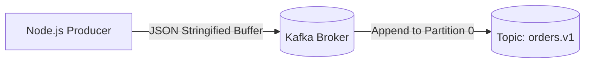

# Lab 01 — Your First Kafka Producer

## Objective
Build a Node.js script using KafkaJS that establishes a TCP connection to Apache Kafka and produces strongly-typed JSON event messages to a topic.

## Prerequisites
- Docker containers running (`npm run docker:up` & `npm run wait:kafka`)
- Node.js installed

## Concept
A Kafka Producer serializes in-memory JavaScript objects into UTF-8 Buffer payloads and pushes them across network sockets to the broker partition leader.

## Architecture


## Run
```bash
npm run lab:01:producer
# Or directly:
node labs/01-first-producer/src/producer.js
```

## Observe
Look at the terminal output. You should see:
```text
✅ Connected to Kafka broker at localhost:9092
📤 Sending order event: ORD-1001...
🎉 Message successfully published!
   Topic:     orders.v1
   Partition: 0
   Offset:    0
```
Open **[http://localhost:8080](http://localhost:8080)** (Kafka UI) -> **Topics** -> `orders.v1` -> **Messages** to view the payload.

## Experiment
1. Modify `src/producer.js` to send an array of 5 different orders in a single `send()` call.
2. Observe how the base offset increments for each message.

## Challenge
Implement a loop in `exercise/producer.js` that emits a continuous stream of telemetry events every 1 second until terminated with `Ctrl+C`.

## Questions
1. What data type does Kafka expect for message keys and values? (Hint: String or Buffer)
2. What happens if the topic does not exist yet when producing? (Hint: `KAFKA_AUTO_CREATE_TOPICS_ENABLE`)
3. Does `producer.send()` return a Promise?
