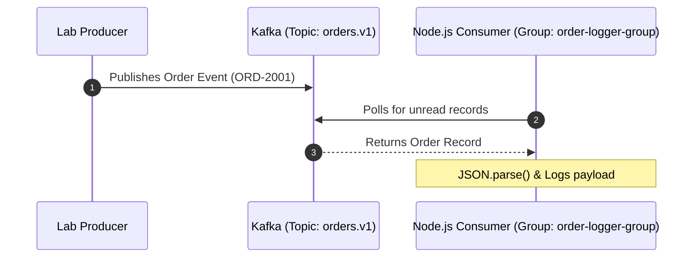

# Lab 02 — Your First Kafka Consumer

## Objective
Build a Node.js event consumer that joins a Consumer Group, subscribes to the `orders.v1` topic, processes incoming messages in real-time, and decodes JSON payloads and headers.

## Prerequisites
- Completed Lab 01
- Kafka running on `localhost:9092`

## Architecture


## Run

### Step 1: Start the Consumer in Terminal 1
```bash
npm run lab:02:consumer
# Or: node labs/02-first-consumer/src/consumer.js
```

### Step 2: In Terminal 2, produce events
```bash
npm run lab:02:producer
# Or: node labs/02-first-consumer/src/producer.js
```

## Observe
Look at Terminal 1. You should see:
```text
📥 [Partition: 0 | Offset: X] Received Event:
   Event ID:   evt_...
   Order ID:   ORD-2001
   User:       USER-5510
   Amount:     $89.50
   Headers:    source: web-checkout
```

## Experiment
1. Stop the consumer with `Ctrl+C`.
2. Run the producer twice to send 2 new messages while the consumer is offline.
3. Restart the consumer. Observe how it immediately catches up and processes the missed messages from where it left off!

## Challenge
Modify `exercise/consumer.js` to calculate and print a running total sum of all order amounts received so far.

## Questions
1. Why must every Kafka consumer specify a `groupId`?
2. What is the difference between `fromBeginning: true` vs `fromBeginning: false`?
3. What happens when a consumer crashes unexpectedly?
