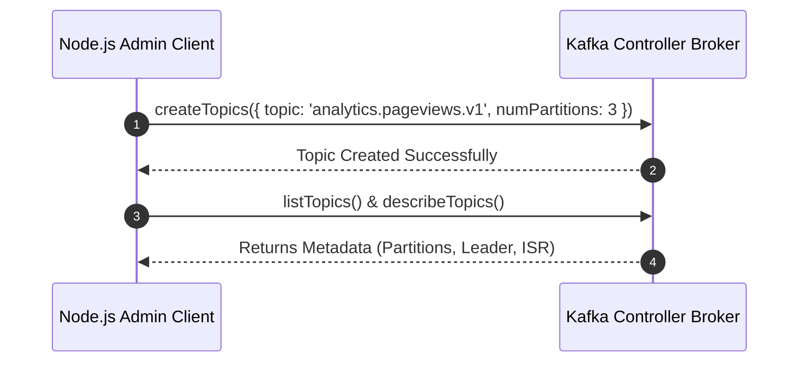

# Lab 03 — Managing Topics with Admin Client

## Objective
Learn how to use the KafkaJS Admin Client to programmatically create topics, configure partitions and replication factors, list topics, describe metadata, and safely alter partition counts.

## Prerequisites
- Completed Lab 01 & 02

## Architecture


## Run
```bash
npm run lab:03:admin
# Or: node labs/03-topics/src/admin.js
```

## Observe
```text
🔨 Creating topic: analytics.pageviews.v1 (3 partitions)...
📋 Listing all topics in cluster...
🔍 Topic Details for analytics.pageviews.v1:
   Partitions: 3
   Partition 0: Leader=1, ISR=[1]
   Partition 1: Leader=1, ISR=[1]
   Partition 2: Leader=1, ISR=[1]
```

## Experiment
Try calling `admin.createPartitions()` to increase the partition count from 3 to 6. Then check Kafka UI.

## Challenge
Implement `exercise/admin.js` to create a topic with a custom retention policy (`retention.ms = 3600000` / 1 hour).

## Questions
1. Why can you increase partition count on a live topic, but cannot decrease it?
2. What does `waitForLeaders: true` do during `createTopics`?
