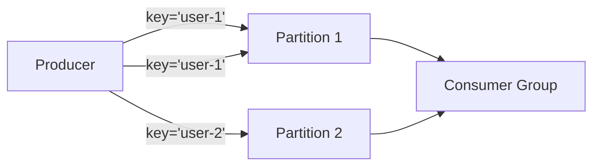

# Lab 06 — Message Keys & Partition Affinity

## Objective
Prove that setting a message key (e.g., `userId` or `orderId`) forces all related events to land in the same partition and be consumed in strict sequential order.

## Architecture


## Run

### Step 1: Start consumer
```bash
npm run lab:06:consumer
# Or: node labs/06-message-keys/src/consumer.js
```

### Step 2: Produce keyed sequence
```bash
npm run lab:06:producer
# Or: node labs/06-message-keys/src/producer.js
```

## Observe
Look at the output. Every event for `USER-ALPHA` lands in **Partition 1**, and every event for `USER-BETA` lands in **Partition 0** (or deterministic hash).
Even if events are sent in interleaved fashion, `USER-ALPHA` events are processed in strict order 1 -> 2 -> 3!

## Challenge
Modify `exercise/producer.js` to send lifecycle events (`CREATED`, `PAID`, `SHIPPED`, `DELIVERED`) for 10 different orders with `key = orderId`. Verify each order finishes in order.
