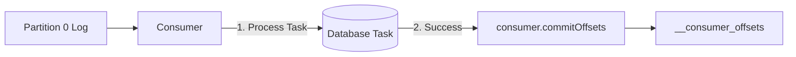

# Lab 07 — Offsets & Manual Commit Strategies

## Objective
Understand how Kafka tracks consumer progress using `__consumer_offsets`, master manual offset commits (`autoCommit: false`), and replay historical messages with `consumer.seek()`.

## Architecture


## Run

### Step 1: Run producer to seed events
```bash
npm run lab:07:producer
# Or: node labs/07-offsets/src/producer.js
```

### Step 2: Run consumer with manual commits
```bash
npm run lab:07:consumer
# Or: node labs/07-offsets/src/consumer.js
```

## Observe
Notice how the consumer explicitly commits the offset only after simulating a database operation.
On startup, if you pass `--replay`, it calls `consumer.seek({ offset: '0' })` and re-reads all messages from the beginning!

## Questions
1. Why is committing `offset + 1` necessary in KafkaJS? (Because committed offset represents the *next* unread message).
2. What happens if an exception is thrown before `commitOffsets()` is called?
