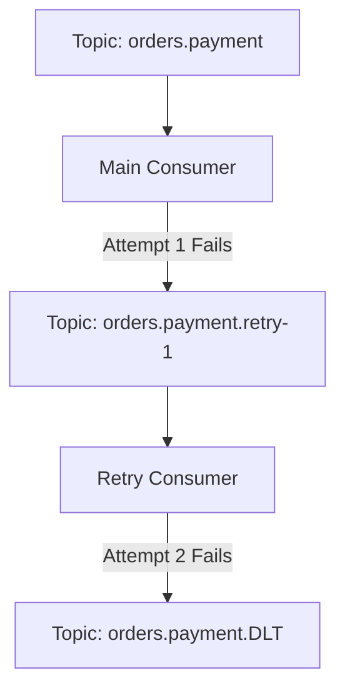

# Lab 08 — Resilient Retries & Non-Blocking Backoff

## Objective
Implement a production-style non-blocking retry pattern using dedicated retry topics (`orders.retry-1`, `orders.retry-2`) to prevent Head-of-Line blocking.

## Architecture


## Run

### Step 1: Start retry consumer
```bash
npm run lab:08:consumer
# Or: node labs/08-retries/src/consumer.js
```

### Step 2: Produce flaky and valid payment requests
```bash
npm run lab:08:producer
# Or: node labs/08-retries/src/producer.js
```

## Observe
- Notice that failing messages are published to `orders.payment.retry-1` with header `x-retry-count: 1`.
- The main consumer immediately commits the offset on the main topic and continues processing subsequent orders without getting blocked!

## Questions
1. What is "Head-of-Line" blocking?
2. Why is sleeping inside the main `eachMessage` handler bad for Kafka consumer groups? (It causes heartbeat timeouts and triggers rebalances).
