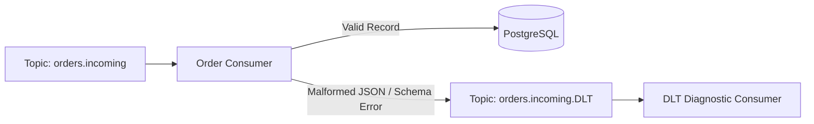

# Lab 09 — Dead Letter Topics (DLT / DLQ)

## Objective
Implement Dead Letter Topic handling to isolate malformed records (poison pills) while attaching complete error diagnostics in headers.

## Architecture


## Run

### Step 1: Start the main consumer
```bash
npm run lab:09:consumer
# Or: node labs/09-dead-letter-topic/src/consumer.js
```

### Step 2: Start the DLT inspector consumer in another terminal
```bash
npm run lab:09:dlt-consumer
# Or: node labs/09-dead-letter-topic/src/dlt-consumer.js
```

### Step 3: Produce valid and corrupt messages
```bash
npm run lab:09:producer
# Or: node labs/09-dead-letter-topic/src/producer.js
```

## Observe
- The corrupt message is automatically routed to `orders.incoming.DLT`.
- The DLT consumer displays original topic, partition, offset, timestamp, and exception stack trace!

## Questions
1. Why should you never discard corrupt records silently?
2. What headers should always be attached to a DLT record?
