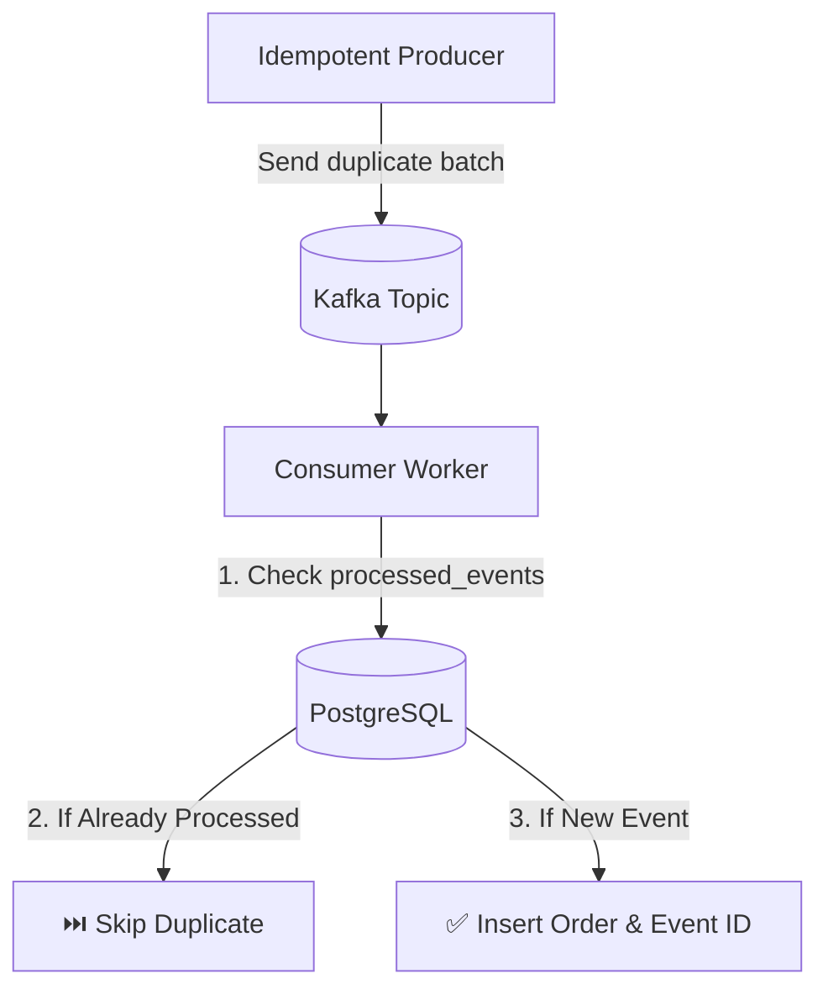

# Lab 10 — Idempotency & Deduplication

## Objective
Build an idempotent event processing pipeline combining KafkaJS Producer Idempotency (`idempotent: true`) and Consumer Idempotency using a PostgreSQL deduplication table.

## Architecture


## Run

### Step 1: Start the idempotent consumer
```bash
npm run lab:10:consumer
# Or: node labs/10-idempotency/src/consumer.js
```

### Step 2: Produce intentional duplicate events
```bash
npm run lab:10:producer
# Or: node labs/10-idempotency/src/producer.js
```

## Observe
- The producer sends the exact same `eventId: 'evt_dup_999'` 3 times.
- The consumer processes the first attempt, records it in PostgreSQL, and cleanly **skips the subsequent 2 duplicates** without throwing an error or double-charging!

## Questions
1. Why does an idempotent producer not protect against consumer replays?
2. What PostgreSQL constraint is used to guarantee atomic deduplication? (`PRIMARY KEY` on `event_id`).
