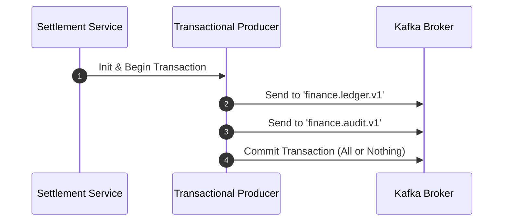

# Lab 11 — Kafka Transactions & Atomicity

## Objective
Implement atomic multi-topic event generation and transactional offset commits using KafkaJS Transactional Producer (`transactionalId`).

## Architecture


## Run
```bash
npm run lab:11:service
# Or: node labs/11-transactions/src/transaction-flow.js
```

## Observe
- The script executes two scenarios:
  1. A successful transaction: both ledger and audit messages are committed atomically.
  2. An aborted transaction: when an error occurs, `transaction.abort()` is called, and zero messages become visible to `read_committed` consumers!

## Questions
1. Why must a transactional producer define a unique `transactionalId`?
2. What happens if a consumer reads with `readUncommitted: true`?
