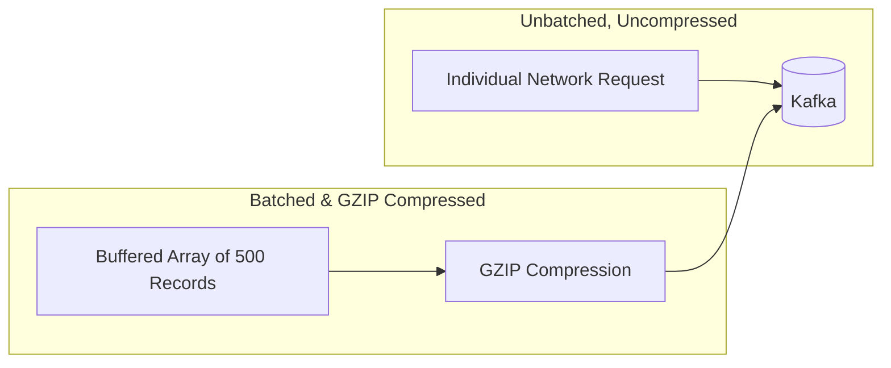

# Lab 12 — Performance Tuning & Benchmarking

## Objective
Benchmark the throughput difference between uncompressed single-message sends versus batched, GZIP-compressed producer pipelines.

## Architecture


## Run
```bash
npm run lab:12:benchmark
# Or: node labs/12-performance/src/benchmark.js
```

## Observe
The benchmark sends 2,000 records using:
1. **Mode 1: Single uncompressed sends** (Sequential promises)
2. **Mode 2: Batched array sends with GZIP compression**

Compare the execution time and messages-per-second (msg/sec) metrics!
Notice how batching + compression delivers a **$10\times$ to $50\times$ throughput boost**.

## Questions
1. Why does batching reduce CPU load on both the client and broker?
2. What are the trade-offs of GZIP vs Snappy compression?
