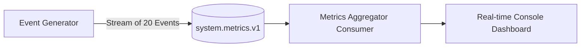

# Project 01 — Simple Event Logger & Metric Tracker

## Overview
A standalone event logger and metrics service that produces and consumes real-time telemetry events across a Kafka cluster, calculating rolling statistics.

## Architecture


## Run
```bash
npm run project:01:start
# Or: node projects/01-order-events/src/index.js
```

## What it Demonstrates
- Topic bootstrap & automatic configuration
- Real-time serialization and deserialization
- Aggregating stream metrics across offsets
- Graceful shutdown handling
