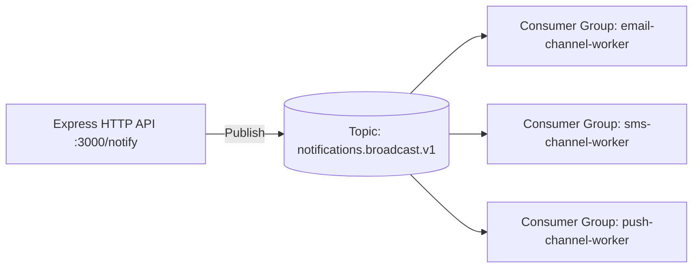

# Project 02 — Multi-Channel Notification Fan-Out System

## Overview
An Express.js HTTP API that receives notification triggers and publishes them to an event topic. Three distinct consumer groups (**Email Service**, **SMS Service**, and **Push Notification Service**) independently consume the exact same event stream concurrently (Fan-Out pattern).

## Architecture


## Run

### Step 1: Start the 3 Worker Channels
```bash
npm run project:02:workers
# Or: node projects/02-notification-system/src/workers.js
```

### Step 2: In another terminal, start the API
```bash
npm run project:02:api
# Or: node projects/02-notification-system/src/api.js
```

### Step 3: Trigger a Notification via HTTP curl / POST
```bash
curl -X POST http://localhost:3000/notify \
  -H "Content-Type: application/json" \
  -d '{"userId": "USER-42", "title": "Security Alert", "body": "New login from Tokyo, Japan"}'
```

## Observe
Look at the workers terminal. Notice how all three services (Email, SMS, Push) each receive the exact same notification in parallel without interfering with each other!
