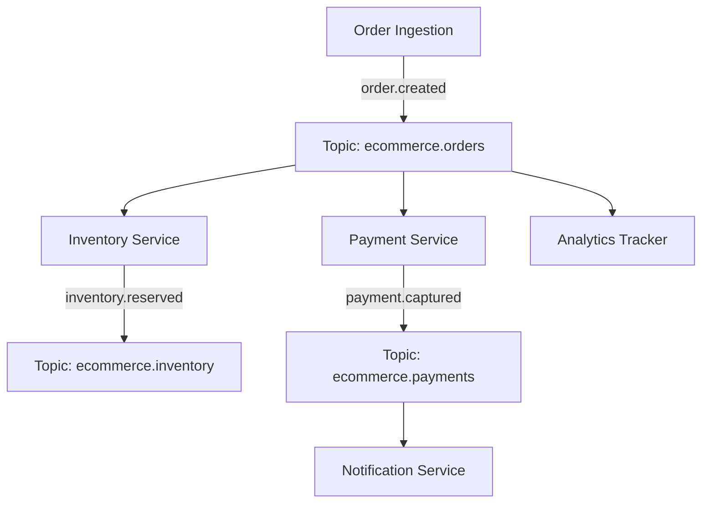

# Project 03 — Event-Driven E-Commerce Platform

## Overview
A choreograph-based event-driven e-commerce microservices cluster demonstrating:
- Order Ingestion
- Inventory Reservation Worker
- Payment Processing Worker
- Customer Notification Service
- Real-time Analytics Tracker

## Architecture


## Run
```bash
npm run project:03:start
# Or: node projects/03-event-driven-ecommerce/src/index.js
```

## Observe
Watch the terminal output as 5 customer orders trigger a cascade of asynchronous, choreographed microservice reactions across multiple Kafka topics!
