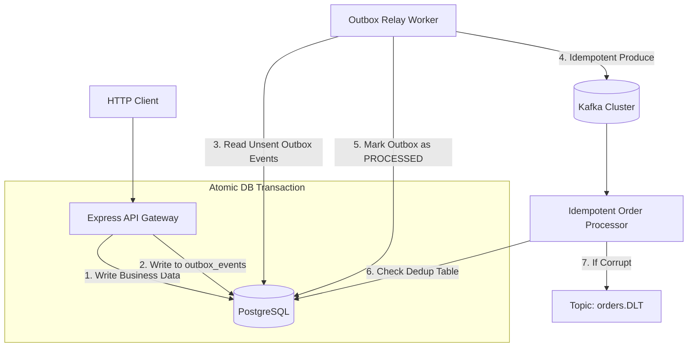

# Project 04 — Production-Grade Event Platform

## Overview
An enterprise-grade event-driven backend platform combining:
1. **Express.js API Gateway**
2. **Transactional Outbox Pattern** (guaranteeing that database mutations and event publications are 100% atomic)
3. **Outbox Relay Daemon** (polling/streaming events to Kafka with idempotent publisher)
4. **Idempotent Worker Services** with deduplication safeguards
5. **Dead Letter Queue (DLQ) Routing** for poison pill exceptions

## Architecture


## Run
```bash
npm run project:04:start
# Or: node projects/04-production-style-platform/src/index.js
```

## Production Highlights Demonstrated
- **Zero Dual-Write Race Conditions**: Solved via Transactional Outbox.
- **At-Least-Once Delivery**: With consumer-side deduplication table.
- **Poison Pill Resilience**: Safe isolation to DLT without halting worker pipelines.
